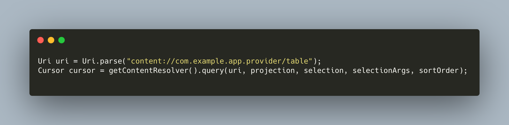
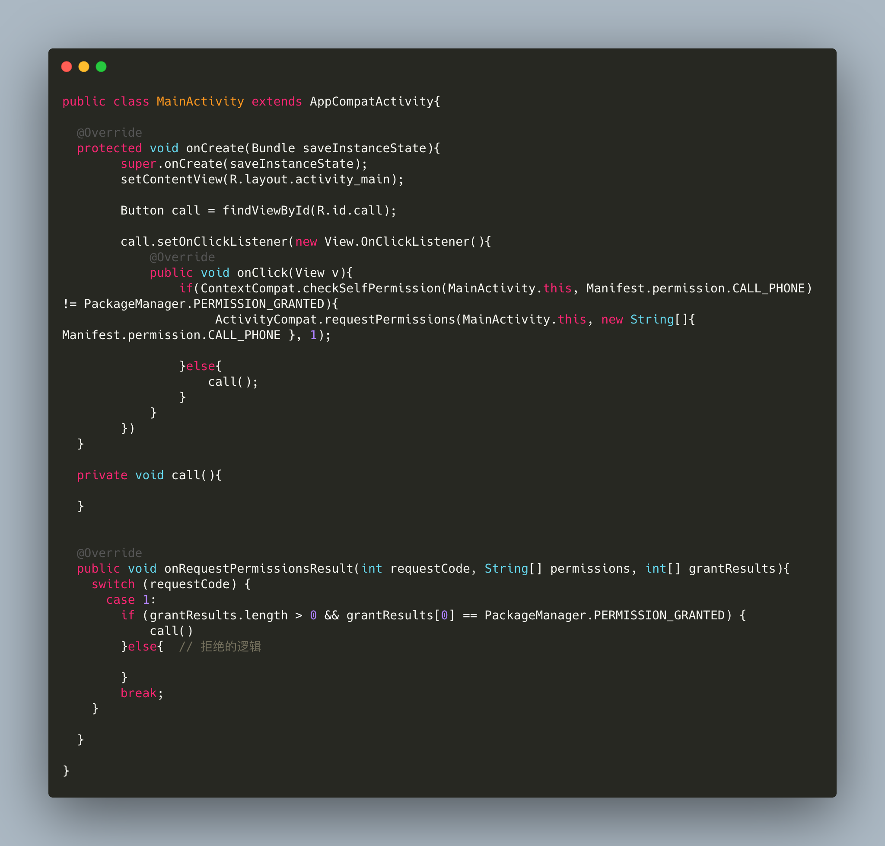
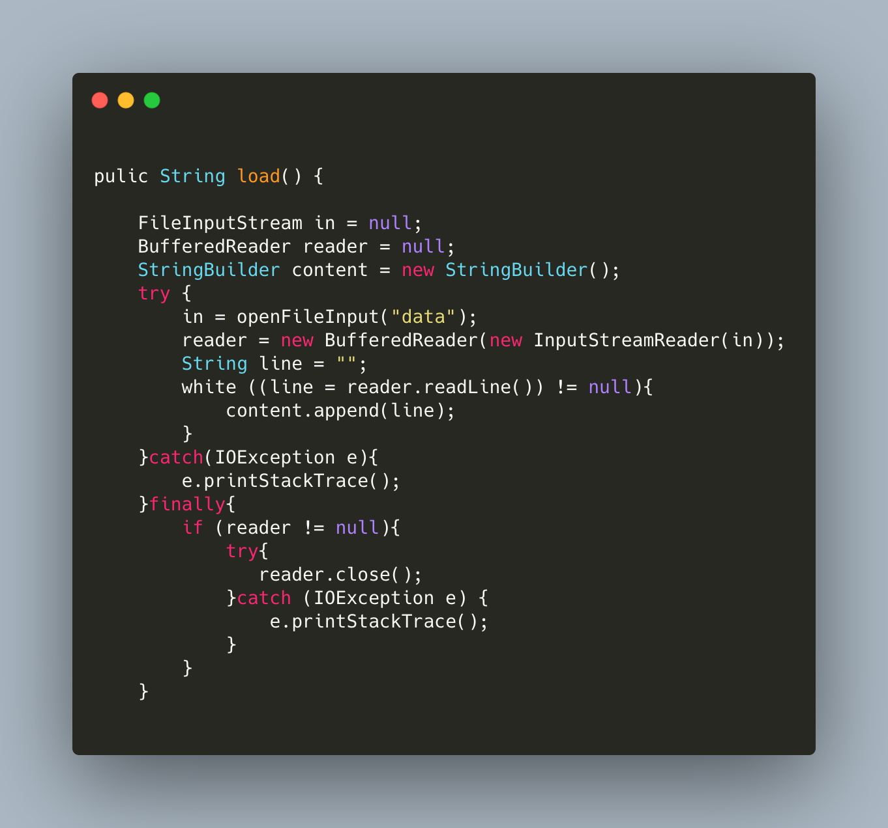
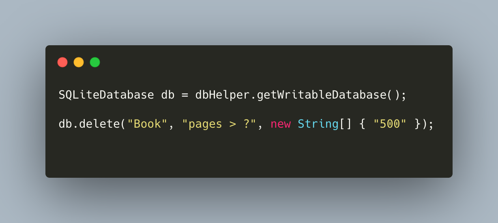

[toc]

# 四大控件

## Activity

> 用户看到的内容，开发者接触最多的控件。

### 使用方法

1. 在AndroidManifest.xml里面注册该活动；
2. 在layout里面新建视图；
3. 集成Activity关联视图；

### 生命周期

> Activity活动的生命周期，每个生命周期在指定的场景触发。

* onCreate
    > 活动在第一次被创建时后创建。在改生命周期内完成活动的初始化操作，加载布局、绑定事件。

* onStart
    > 该方法在活动由不可见变成可以的时候调用。
 
* onResume
    > 活动准备好和用户进行交互的时候调用，活动位于返回栈的栈顶，并且处于运行状态。
    
* onPause
    > 系统准备去启动或则回复另一个活动的时候调用。通常在这个方法将一些消耗CPU的资源释放掉，以及保存一些关键数据，方法的执行数据要快，不然会影响新的栈顶活动的使用。

* onStop

    > 这个方法在活动完全不可见的时候调用，它和onPause的区别在于，如果启动的新活动是一个对话框，那么onPause会执行，而onStop不会执行。

* onDestory

    > 这个方法在活动被销毁前调用，之后的活动状态将变为销毁状态。

* onRestart

    > 这个方法在活动由停止状态变为运行状态之前调用，也就是活动被重新启动。

#### 常见的几种生命周期过程

* 第一次初始化的生命周期流程

    > onCreate -> onStart -> onResume

* 页面跳转到其他页面的生命周期

    > onPause -> onStop 

* 出现弹窗

    > onPause

* 关闭弹窗

    > onResume

* 返回到页面的生命周期

    > onRestart -> onStart -> onResume

* 退出页面

    > onPause -> onStop -> onDestory

### 活动的启动模式

> 启动模式分为4种，分别是standard、singleTop、singleTask和singleInstance，可以在AndroidMainfest.xml中给<actvity>标签指定android:launchMode属性来选择启动模式。

* standard

    > 默认的启动模式，每次启动都创建一个新的实例，不会在乎返回栈中是否存在改实例。

* singleTop

    > 当返回栈的栈顶是该活动，认为可以直接使用它，不会创建新的活动实例。

* singleTask

    > 启动新的活动会检查返回栈中是否存在该活动的实例，当返回栈中存在该页面栈，并在该活动之上的所有活动统统出栈，没有发现就会创建新的活动实例。

* singleInstance

    > 另起一个返回栈管理该页面，其他的程序跳转过来的时候共用一个返回栈。当穿在该模式的时候，返回的时候会先清除正常的返回栈，再清除该模式下的页面返回栈。

***

## Broadcast

### Broadcast介绍

> 每个应用程序都可以对自己感兴趣的广播进行注册，这样该程序就只会接收到自己所关心的广播内容，这些广播可能来自于系统的，也可能是来自于其他应用程序的。

### 广播接收器（Broadcast Receiver）

* 标准广播

    > 完全异步执行的广播，广播放出后，所有的广播接收器几乎都会在同一时刻接收到这条广播信息，因此它们之间没有任何先后顺序可言。这种广播的效率会比较高，但同时意味着它无法被截断。

* 有序广播

    > 有先后顺序的广播，优先级高的广播接收器先收到消息，并且前面的广播接收器可以截断正在传播的广播。

### 注册方式

> 在代码里面注册的方式为动态注册，在AndroidManifest.xml里面注册的方式为静态注册。

### 创建接收器

* 动态注册

    1. 继承BroadcastReceiver并重写父类的onReceive方法，处理逻辑在该方法内；
    2. 实例化IntentFilter，添加对应的action;
    3. 执行registerReceiver传入receiver和intentFilter;

* 静态注册
    1. 继承BroadcastReceiver并重写父类的onReceive方法，处理逻辑在该方法内；
    2. 在AndroidManifest.xml里面注册receiver并添加有监听的action 的intent-filter;

* 自定义广播

> 注册的过程是一样的，发送广播的时候实例化一个Intent，运行sendBroadcase传入intent就会发送该条广播。

* 有序广播

> 跟标准广播是一样的就是执行的是sendOrderedBroadcast()，在注册广播的xml里面的intent-filter里面的android:priority可以添加优先级，先接收到的广播可以通过abortBroadcast的方式阻止广播继续传播。

* 本地广播

> 使用LocalBroadcastManager对广播进行管理，使用方式跟动态注册一样，不过使用LocalBroadcastManager管理，发送和接收广播使用的是LocalBroadcastManager的单例，使用的是LocalReceiver的实例。

### 业务应用场景

> 强制下线，在BaseActivity里面注册广播接收器，用户退出登录后发出广播，弹出弹窗引导用户到登录页。

***

## Content Provider

### Content Provider介绍

> 内容提供器主要用于不同程序之间实现数据共享的功能，它提供了一套完整的机制，允许一个程序访问另一个程序中的数据，同时还能保证被访问数据的安全性。内容提供器的用法有两种，一种是使用现有的内容提供器来读取和操作相应程序中的数据，另一种是创建自己的内容提供器给我们程序的数据提供外部访问的接口。

### ContentResolve的基本用法

> 如果想要访问内容提供器中共享的数据，要借助ContentResolver类，可以通过Context中的getContentResolver()方法获取到该类的实例。ContentResolve中提供了一系列的方法用于对数据进行CRUD操作。ContentResolver中的方法不接受表名参数，而是使用Uri参数代替，这个参数被称为内容URI。内容URI给内容提供器中的数据建立了唯一标识符，它由两部分组成：authority和path。authority用于对不同的应用程序做区分的，为了避免冲突，会采用程序包名的方式。path用于对同一程序中不同的表做区分。我们还需要在头部加上协议。`content://com.example.app.provider/table1`

* 与SQLiteDatabase的query方法参数对照表

|query方法参数|对应SQL部分|描述|
|:----:|:-----:|:----:|
|uri|from table_name|指定查询某个应用程序下的某一张表|
|projection|select column1, column2|指定查询的列名|
|selection|where column = value|指定where的约束条件|
|selectionArgs|-|为where中的占位符提供具体的值|
|sortOrder|order by column1, column2|指定查询结果的排序方式|

> 查询完成后返回Cursor对象，这时我们可以将数据从Cursor对象中逐个读取出来。通过移动游标的位置来遍历Cursor的所有行，然后再取出每一行中相应列的数据，代码如下

_1.png)

* 代码演示CRUD

_2.png)

#### 读取系统联系人（案例）

.png)

### 创建内容提供器

# 权限

## 权限介绍

> Android开发团队在android 6.0系统引用了运行时权限这个功能，从而更好地保护了用户的安全和隐私。在6.0之前在安装软件的时候列出所有的权限列表，同意后才能安装。权限的氛围两类，一类是普通权限，一类是危险权限。普通权限指不会威胁到用户的安全和隐私的权限，对于这不部分权限申请，系统会自动帮我们进行授权，不需要用户手动操作。危险权限则表示哪些可能触及用户隐私或对设备安全性造成影响的权限，如获取设备联系人信息、定位设备的地理位置等，需要用户手动点击授权才可以，否则程序无法使用相应的功能。

## 危险权限
|权限组名|权限名|
|:----:|:----:|
|CALENDAR|READ_CALENDAR、WRITE_CALENDAR|
|CAMERA|CAMERA|
|CONTACTS|READ_CONTACTS、WRITE_CONTACTS、GET_ACCOUNTS|
|LOCATION|ACCESS_FINE_LOCATION、ACCESS_COARSE_LOCATION|
|MICROPHONE|RECORD_AUDIO|
|PHONE|READ_PHONE_STATE、CALL_PHONE、READ_CALL_LOG、WRITE_CALL_LOG、ADD_VOICEMALL、USE_SIP、PROCESS_OUTGOING_CALLS|
|SENSORS|BODY_SENSORS|
|SMS|SEND_SMS、RECEIVE_SMS、READ_SMS、RECEIVE_WAP_PUSH、RECEIVE_MMS|
|STORAGE|READ_EXTERNAL_STORAGE、WRITE_EXTERNAL_STORAGE|

`每个危险权限属于一个权限组，我们进行运行时权限处理时使用的是权限名，用户一旦同意授权，那么该权限所赌赢的权限组所有其他的权限也会被授权。`

## 运行时申请权限的过程

1. 通过调用ContextCompat.checkSelfPermission方法，入参第一个为当前活动的上下文，第二个为需要申请的权限；
2. 判断checkSelfPermission调用的结果是否等于PackageMananger.PERMISSION_GRANTED；`PackageMananger.PERMISSION_GRANTED为同意PackageMananger.PERMISSION_DENIED为否认`
3. 已授权就继续下面的逻辑，未授权就调用ActivityComap.requestPermissions发起授权，该方法第一个为当前活动的this，第二个为权限列表，第三个为请求码
4. 在Activity的onRequestPermissionsResult回调中处理用户同意或拒绝的逻辑

* 代码演示

***

# 数据存储

## 文件存储

#### 文件存储介绍

> 文件存储是Android中最基本的一种数据存储方式，它不对存储的内容进行任何的格式化处理，所有数据都是原封不动地保存到文件当中的，因而它比较适合用于存储一些简单的文本数据或二进制数据。如果你想使用文件存储的方式保存一些较为复杂的文本数据，需要定义一套自己的格式规范，方便之后将数据从文件中重新解析出来。

#### 文件存储实现

> Context类的`openFileOutput()`方法，第一个参数问文件名，第二个为文件的操作模式，两种操作模式:

1. `MODE_PRIVATE`写入的内容覆盖源文件的内容；
2. `MODE_APPEND`该文件已存在，就往文件里面追加内容，不存在就创建新文件；

> openFileOutput返回一个`FileOutputStream`对象，得到这个对象可以以java流的方式将数据写入文件中。

_1.png)

> Context类中的`openFileInput()`方法，用于从文件中读取数据。接收一个参数，要读取的文件名，执行后返回一个`FileInputStream`对象，得到这个对象通过java流的方式将数据读取出来。

[java流](https://www.runoob.com/java/java-files-io.html)

## SharedPreferences存储

> 使用键值对的方式来存储数据。当保存一条数据的时候，需要给这条数据一个对应的键，读取的时候通过这个键把相应的值取出来。SharedPreferences支持多种不同改的数据类型存储。

### 将数据存储到SharedPreferences

* 三种方式获取SharedPreferences对象。

    1. Context类中的getSharedPreferences方法，第一个参数文件名称，第二个为操作模式，只有一种`MODE_PRIVATE`模式；
    2. Activity中的getPreferences方法，跟Context类似，不过只接收一个操作模式参数；
    3. PreferenceManager类中的getDefaultSharedPreferences()方法，接收Context参数，并使用当前程序的包名作为前缀来命名SharePreferences文件。

* 实现步骤

    1. 调用SharedPreferences对象的edit()方法获取一个SharedPreferences.Editor对象；
    2. 向SharedPreferences.Editor对象添加数据`putBoolean`；
    3. 调用apply()方法将添加的数据提交，从而完成数据存储操作；

_2.png)

### 从SharedPreferences中取数据

_3.png)

## SQLite

> 存储大量复杂的关系型数据的时候是用该方式。android提供了一个SQLiteOpenHelper帮助类，借助这个类可以非常简单的对数据库进行创建和升级。SQLiteOpenHelper有两个非常重要的实例方法：getReadableDatebase()和getWriteableDatebase()。可以创建或打开一个现有的数据库`已存在直接打开，否则创建新的数据库`。SQLiteOpenHelper构造方法接收四个参数，`第一个为Context，第二个为数据库名，第三个参数允许查询数据是返回一个自定义的Cursor，一般传null，第四个为当前数据库的版本号。`数据库文件存在`/data/data/<package name>/database/`目录下。

* create

.png)

* insert

 .png)
 
 
 * update 四个参数，第一个为表名，第二个为修改的数据，第三个和第四个为判断条件修改的哪条数据

.png)

* delete 三个参数，第一个为表名，第二个和第三个为约束判断条件

* query 

|query()方法参数|对应SQL部分|描述|
|:--:|:--:|:--:|
|table|form table_name|指定查询的表名|
|columns|select column1, column2|指定查询的列名|
|selection|where column = value|指定where的约束条件|
|selectionArgs|-|为where中的占位符提供具体的值|
|groupBy|group by column|指定需要groupBy的列|
|having|having column = value|对group by后的结果进一步约束|
|orderBy|order by column1, column2|指定查询结果的排序方式|

.png)

* SQL语句

.png)

